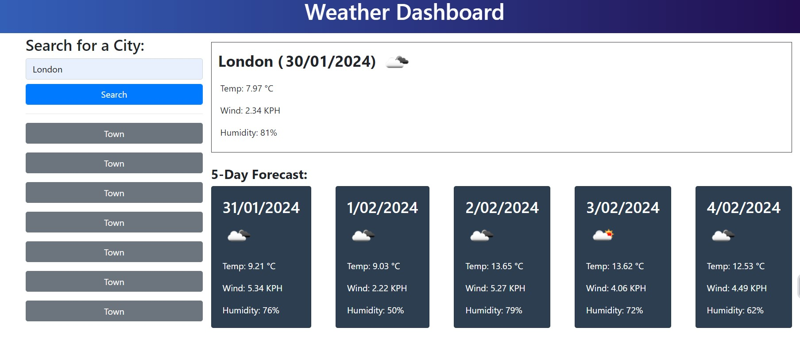
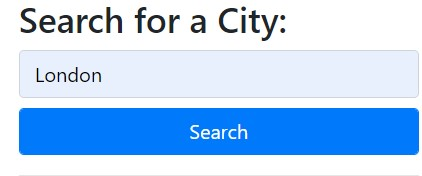
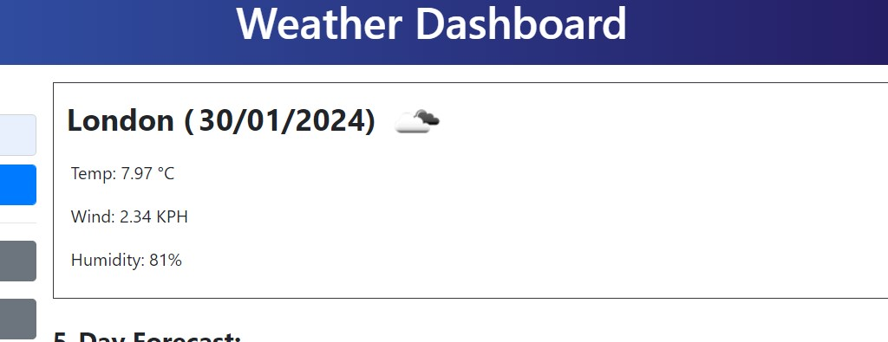
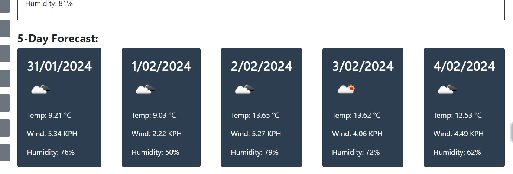
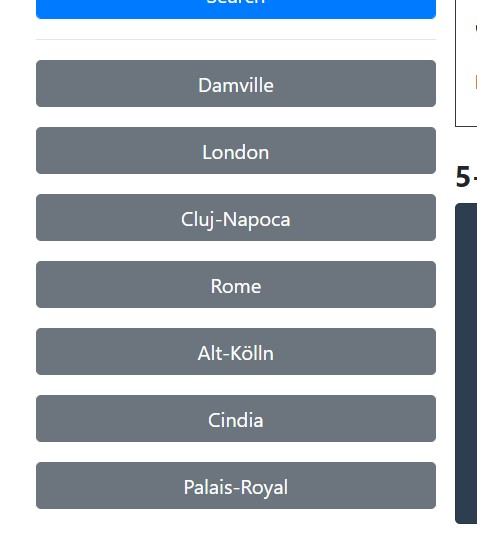

# Weather-Dashboard

Weather outlook for multiple cities

## Description

This project displays the weather and the wether forecast for the next 6 days.

## Instalation

The website page can be accessed [here](https://ionescuea.github.io/Weather-Dashboard/).

## Usage

The page displays the weather for a specific city for a period of 6 days (current day and 5 days forecast).

Using the input box, the user can search a city and get the data for the weather by accessing the http://api.openweathermap.org/ data. The data is extracted from this website in real time.

On the right side of the search button, at the top, the current day data is displayed for the requested city.

Below the current day, there is the data forecast for the next 5 days, for the same city.

Also, the page contains a history section that displays the names of the cities that were searched before. The data for these is saved on the local storage.

## Credits

[BootcampSpot](https://github.com/edx)

[Alexandra Ionescu](https://github.com/ionescuea)

## License

Licensed under the [MIT](LICENSE) license.
